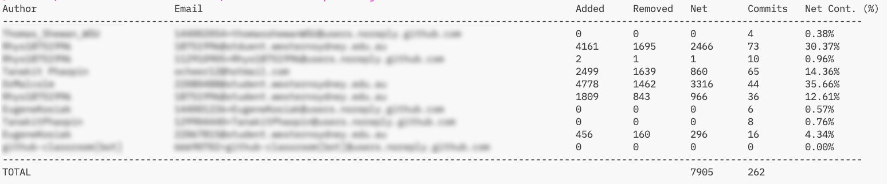

## Contribution Script for COMP3028 Software Construction

This script will go through and review every file that is on the main and
calculate the lines added and removed by each individual student, then 
total a net line additions. It will also total the commits of each student
on the `master`/`main` branch. The total weight is 75% for line additions
and 25% for commits. 

### Dependencies

This is a Node.js script with no required modules. 

### Running Contribution Script

Once installed, you can run the script **within** a group repository root

```shell
$ node contribution-scriptv2.1.mjs [output_prefix] [--no-csv]
```

#### ARGUMENTS

`output_prefix` (optional)

A prefix to use for the output CSV file name. If provided, the output file will be named as `[output_prefix]-contribution-summary.csv.`

`--no-csv` (optional)

If this flag is provided, the script will skip creating a CSV file and will only display the information in the terminal.

### Output
There are two outputs:

- Terminal Output
- [optional] CSV file place in the current directory `[groupname-]contribution-script`

The total contribution output is a combination of overall code contribution (75%) and
total commit contribution (25%) to the **main** branch. 

As this analysis tool performs analysis at a granular level, there may be more GitHub accounts listed than members within a respository or team. 
This happens for a variety of reasons:

- When a contribution is committed in the browser and so the account handle is slightly different.
- A contributors local machine credentials are not complete, yet their authentication credentials are.
- Teaching staff contribute. 
- A GitHub bot contributes auto generated code

Although the figure below is blured for privacy, it is clear who the contributors were in this repos/team, and it links to their registered
GitHub Account or student ID associated with their github account. 



### Folder Parsing

If you have downloaded all repos into a single directory, you will be able to parse all
repos at once with the following shell script:

```shell
for i in group-project*; do 
    stripped_name=$(echo $i | sed 's/^group-project-[0-9][a-z]-//')
    (cd "$i" && 
     node ../contribution-script/contribution-script.mjs "$stripped_name" && 
     mv "${stripped_name}-contribution-summary.csv" ..)
done
```
